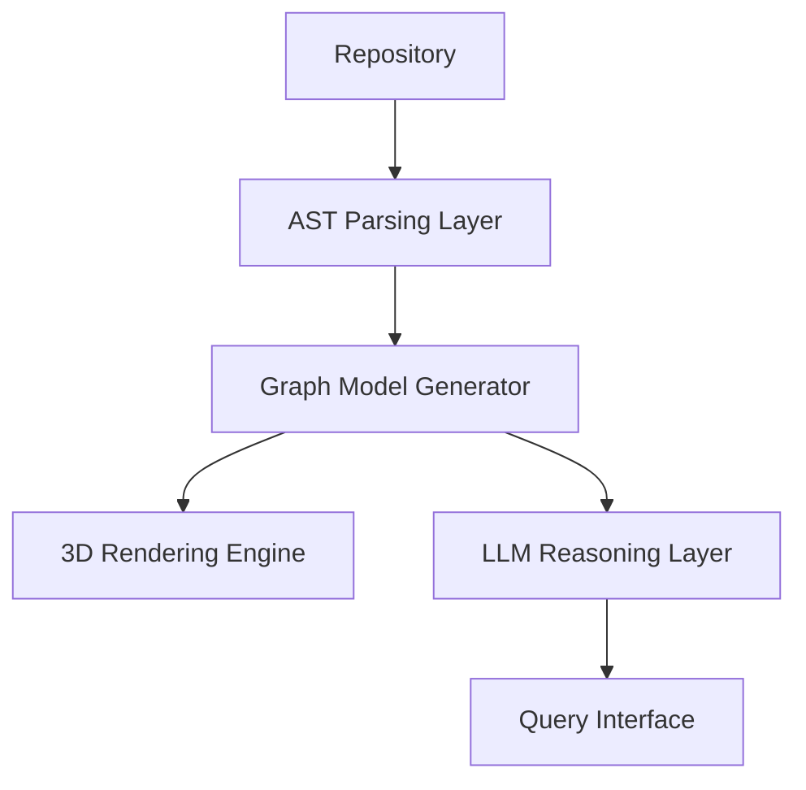

# InsightFlow 3D

AI-powered 3D repository visualization platform with offline LLM reasoning.

> Status: Active development

---

##  Why InsightFlow Exists

Understanding large codebases is difficult, especially for new contributors.  
InsightFlow transforms a repository into an interactive 3D “code city” to improve architectural comprehension, dependency tracing, and onboarding speed.

Instead of scanning thousands of lines of code, developers explore structure visually and query behavior using local AI models — fully offline.

---

##  System Architecture




---

## Core Components

### 1️. Repository Ingestion
- Filesystem + Git access  
- Directory → File → Function normalization  
- Language-agnostic structure mapping  

### 2️. Static Code Analysis
- TypeScript Compiler API  
- Babel parser  
- Python AST  
- Extracted metadata:
  - Directory hierarchy
  - Function definitions
  - Call relationships
  - Structural complexity metrics

### 3️. 3D Visualization Engine
- React + Three.js + React-Three-Fiber  
- Directories → districts  
- Files → buildings (height = complexity)  
- Functions → animated entities  

### 4️. Offline AI Reasoning
- Ollama local models (Llama3, Mistral, Phi-3)  
- Repo-aware explanations  
- Dependency tracing  
- Risk identification  
- Fully privacy-preserving  

---

##  Tech Stack

Frontend:
- React
- Vite
- Three.js
- React-Three-Fiber
- Zustand

Analysis:
- AST parsing (TypeScript, Babel, Python)
- Model Context Protocol (MCP)

AI:
- Ollama (local inference)

---

##  Design Principles

- Privacy-first (no cloud dependency)
- Architecture-first visualization
- Offline AI reasoning
- Developer onboarding acceleration

---

##  Running Locally

```
npm install  
npm run dev  
```
---

##  Project Goal

InsightFlow explores how visualization + AI can fundamentally change how developers interact with large systems by combining static analysis, graphics rendering, and local LLM reasoning into a unified developer experience.
